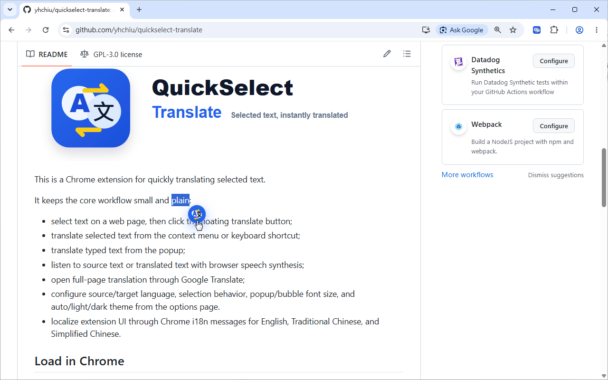
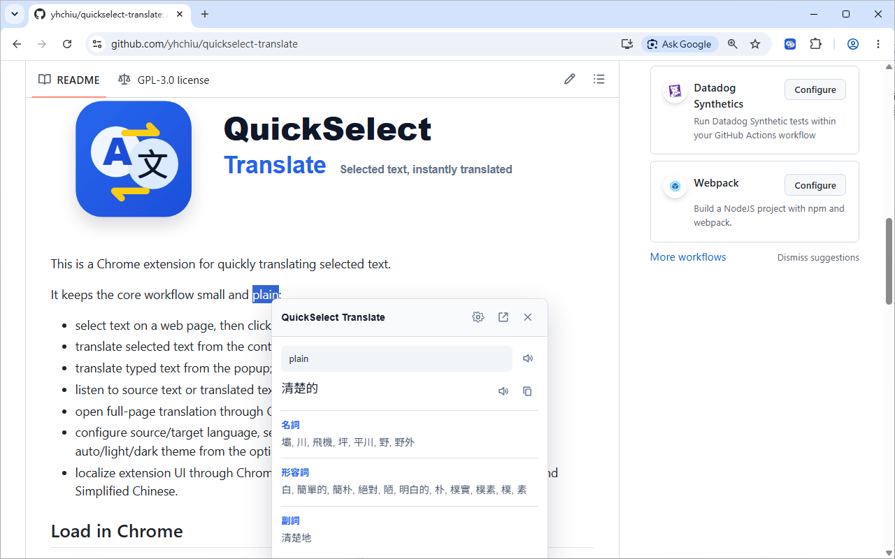
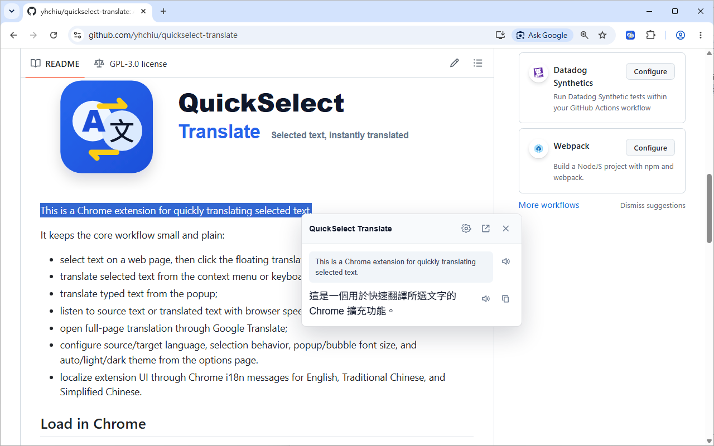
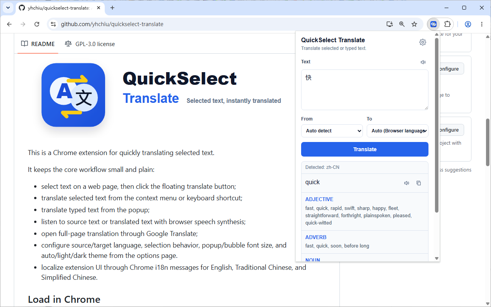
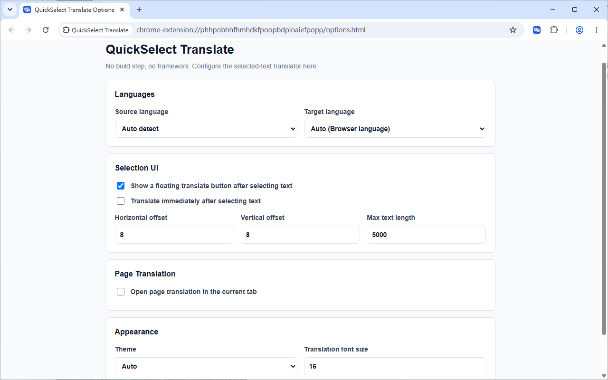

# QuickSelect Translate


This is a Chrome extension for quickly translating selected text.

It keeps the core workflow small and plain:

- select text on a web page, then click the floating translate button;
- translate selected text from the context menu or keyboard shortcut;
- translate typed text from the popup;
- listen to source text or translated text with browser speech synthesis;
- open full-page translation through Google Translate;
- configure source/target language, selection behavior, popup/bubble font size, and auto/light/dark theme from the options page.
- localize extension UI through Chrome i18n messages for English, Traditional Chinese, and Simplified Chinese.

## Screenshots

### Translation Bubble




### Extension Popup Interface


### Settings


## Load in Chrome

1. Open `chrome://extensions`.
2. Enable Developer mode.
3. Click **Load unpacked**.
4. Select this extension folder.

No `npm install` or build step is required.

## Translation backend

The extension uses Google Translate's public web endpoint:

```text
https://translate.googleapis.com/translate_a/single?client=gtx
```

The endpoint is convenient for a lightweight extension, but it is not an official paid Google Cloud Translation API contract. For production or store distribution, consider adding a proper API-backed provider and clearer quota/error handling.

## Privacy

See [`PRIVACY.md`](PRIVACY.md).

## Pronunciation

Pronunciation uses the browser's Web Speech API (`speechSynthesis` and `SpeechSynthesisUtterance`) instead of Google Translate audio. Voice quality and available languages depend on the user's browser, OS, and installed voices.

## Tests

Tests use Node's built-in test runner and do not require `npm install`.

Run all tests from this folder:

```sh
node --test tests/*.test.js
```

The tests use mocked Chrome extension APIs, mocked DOM objects, and mocked network responses. They cover translation parsing and errors, request caching, context menu routing, Google Translate URL generation, translation bubble helpers, hover auto-hide behavior, appearance setting updates, copy success feedback, speech synthesis helpers, popup rendering, options form handling, and i18n locale consistency.

## License

This project is licensed under the GNU General Public License v3 (GPL v3).

Copyright (C) Yu-Hsiung Chiu

## Contributing

Contributions are welcome! Please feel free to submit issues, feature requests, or pull requests.
